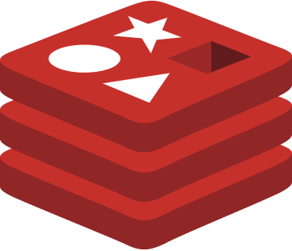

## 👋 Hi, I’m MD Hassan Ansari
- 👀 I’m interested in Coding "Python Developer" 
- 🌱 I’m currently learning [Python, React]
- 💞️ I’m looking to collaborate With Google 'Yup,this is joke' 😂

<table>
    <td>Languages</td>
    <td></td>
    <td></td>
    <td></td>
    <td></td>
    <td></td>
    <td></td>
</table>
<table>
  <tr>
    <td>Database</td>
    <td></td>
     <td></td>
     <td></td>
     <td></td>
  </tr>
</table>
<table>
   <tr>
    <td>DevOps</td>
    <td></td>
     <td></td>
     <td></td>
     <td></td>
  </tr>
 </table>
 <table>
 <tr>
    <td>UI Design</td>
    <td></td>
    <td></td>
    <td></td>
  </tr>
 </table>
 <table>
  <tr>
    <td>Cloud</td>
    <td></td>
    <td></td>
    <td></td>
  </tr>
</table>

 ## Purpose To Make You Easier :)
 
|PDFs Download | [Python JNB Notes](https://drive.google.com/drive/folders/1N0UPoCPz-x_VjzPuPCJ_oKT_lI2MFZmG?usp=sharing) | [HTML-5 Cheat Sheet](https://drive.google.com/drive/folders/19PKKraXvm7txRRlK1U19Wg7ImWChGlcX?usp=sharing) | [CSS-3 cheat sheet](https://drive.google.com/drive/folders/1vaGVnqSHfbqTUHlCKsE4U2wk9KRGjv-z?usp=sharing)
| --- | --- | -- | ---
|YT Channel Suggest |[FreeCodeCamp](https://www.youtube.com/c/Freecodecamp) |[CodeWithHarry](https://www.youtube.com/channel/UCeVMnSShP_Iviwkknt83cww) |[Geeky Shows](https://www.youtube.com/user/GeekyShow1)

---
 
<table>
  <th> </th>
  <th></th>
</table>
<table>
  <th></th>
</table>
<!---
MdHassan413/MdHassan413 is a ✨ special ✨ repository because its `README.md` (this file) appears on your GitHub profile.
You can click the Preview link to take a look at your changes.
--->
